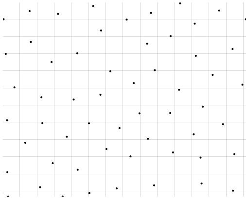
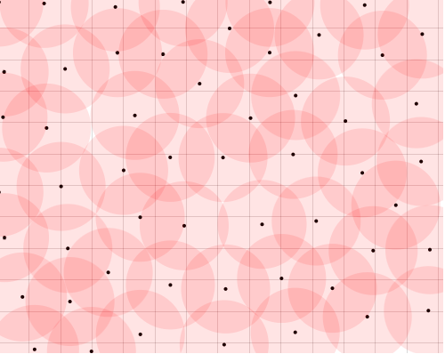
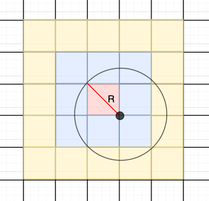
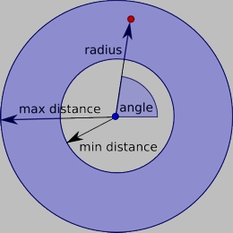

> [更多算法](https://observablehq.com/collection/@observablehq/algorithms)

### 泊松圆盘采样(Poisson-Disk Sampling)

#### 1、目标
需要在一个宽高为(width,height)的平面内平均生成一堆的点，且这些点之间的距离不能小于采样半径R。

如果以每个点为圆心,半径为R,那么每个圆内都不应该出现其他的采样点。

#### 2、性质
一个理想的 Poisson 圆盘采样点集需要满足的条件:
- 任意两个采样点之间的距离大于给定的**采样半径R**
- 采样区域被所有的采样圆盘完全覆盖

#### 3、实现
> [【熟肉】[Unity] 程序化物体放置(E01 - 泊松圆盘采样)](https://www.bilibili.com/video/BV1KV411x7LM?from=search&seid=6692815082012863813)
>
可以通过生成点,然后计算是否在所有点的半径内比较,但是效率很低。

**Robert Bridson**提出了**Fast Poisson Disk Sampling in Arbitrary Dimensions**算法。

**步骤0:**
- 创建一个网格，使每个**单元格**最多包含一个**采样圆盘点**。
- 那么**单元格**的对角线长度应等于**采样圆盘**的半径R。
- 这样**采样圆盘**无论在**单元格**的哪个位置,**单元格**都会被保证覆盖。
- 同时,**采样圆盘**无论在**单元格**的哪个位置, **采样圆盘**的半径R也不会超过它所在**红色单元格**为中心的5*5**黄色单元格**的范围内。
- 意味着,计算新点到所有现有点的距离,只需要考虑5*5的网格内的点。

设单元格边长为$a$,有:
$$
a^2+a^2 =R^2 \\
$$

那么:
$$
a=\frac{R}{\sqrt{2}}
$$

**步骤1:**
随机选择一个采样点。将其插入背景网格，并使用该索引存储采样位置。放入活动队列。

**步骤2:**
当活动列表不为空时，从中选择一个随机索引（比如 i）。从围绕 xi 的半径 r 和 2r 之间的球面环中均匀选择最多 k 个点。

检查它所在5*5范围是否在现有样本的距离 r 内（使用背景网格仅测试附近的样本）。如果一个点距离现有样本足够远，则将其作为下一个样本发出并将其添加到活动列表中。如果在 k 次尝试后没有找到这样的点，则将 i 从活动列表中删除。
