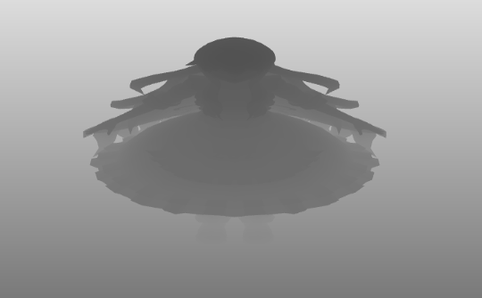

### 一、硬阴影
npm run dev

#### Direct light
- cube mesh
- cube mat
- fbo: fbo

#### PhongMaterial
- uShadowMap: light.fbo

#### ShadowMaterial
- uShadowMap: light.fbo

#### 阴影产生的过程:
渲染对象: mary 和 floor。

每个渲染对象有两个材质, `ShadowMaterial`, `PhongMaterial`。

首先渲染`ShadowMaterial`材质。
- 计算光源的MVP矩阵, lightMVP
- 渲染光源处相机得到的深度图片,存储到纹理中
  

最后渲染`PhongMaterial`材质.

###  二、Percentage-Closer Filtering（百分比接近过滤）
> https://xiaoiver.github.io/coding/2018/09/27/%E5%AE%9E%E6%97%B6%E9%98%B4%E5%BD%B1%E6%8A%80%E6%9C%AF%E6%80%BB%E7%BB%93.html

#### Poisson-Disc(柏林分布)

